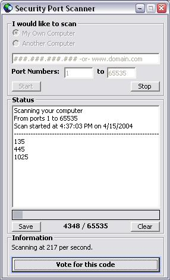



## Security Port Scanner

### Description

Security Port Scanner can check for open ports on your own or a friend's computer. You can specify what ports to scan, and they will be added to the listbox when a successful connection has been made. A recommendation message box will popup if any open ports are found on your own system to install a personal firewall, but that will only happen once if you dont care. Security Port Scanner is high speed, and has scan rates of over 200 ports per second on local scans, and 100 ports per second on remote scans. The computer I tested this on was a 1.4 GHZ Celeron with 128 RAM using Cox Cable Internet, so your results may be diffrent. I hope this will help you out, I have seen many slower and less efficent ones here on planet source code. Votes and feedback appreciated.
 
### More Info
 

             |
---                |---
**Submitted On**   |2004-04-15 16:54:50
**By**             |[Xomni Networks](https://github.com/Planet-Source-Code/PSCIndex/blob/master/ByAuthor/xomni-networks.md)
**Level**          |Intermediate
**User Rating**    |4.1 (29 globes from 7 users)
**Compatibility**  |VB 5\.0, VB 6\.0
**Category**       |[Internet/ HTML](https://github.com/Planet-Source-Code/PSCIndex/blob/master/ByCategory/internet-html__1-34.md)
**World**          |[Visual Basic](https://github.com/Planet-Source-Code/PSCIndex/blob/master/ByWorld/visual-basic.md)
**Archive File**   |[Security\_P1733904152004\.zip](https://github.com/Planet-Source-Code/xomni-networks-security-port-scanner__1-53183/archive/master.zip)

